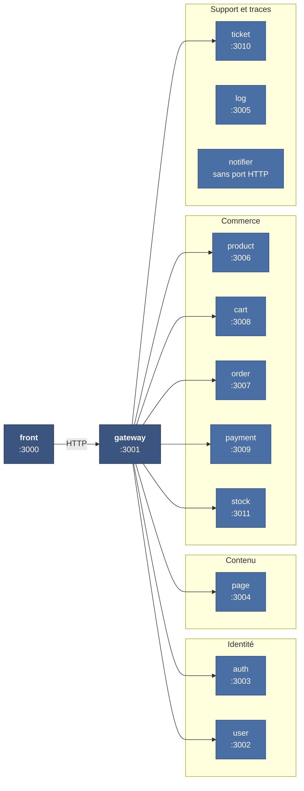
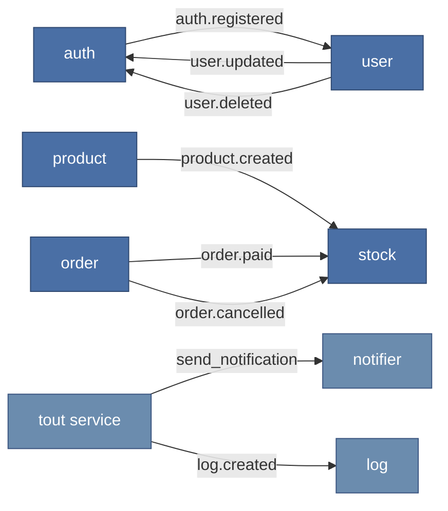

# Composants d'un site généré

Niveau 3 du modèle C4 : l'intérieur d'un site client.

## Les onze services et leurs ports

`notifier-service` n'expose aucun port HTTP : il ne consomme que des événements. C'est le seul
service sans persistance non plus — il transforme un message en courriel et s'arrête là.

## La carte des événements

Ce que la passerelle ne montre pas : ce que les services se disent entre eux, sans passer par
elle.

| Événement | Émis par | Consommé par | Effet |
| --- | --- | --- | --- |
| `auth.registered` | auth | user | Crée le profil correspondant au compte |
| `user.updated` · `user.deleted` | user | auth | Répercute le changement sur les identifiants |
| `product.created` | product | stock | Ouvre une ligne de stock pour le produit |
| `order.paid` | order | stock | Confirme la réservation |
| `order.cancelled` | order | stock | Libère la réservation |
| `send_notification` | plusieurs | notifier | Envoie un courriel |
| `log.created` | plusieurs | log | Journalise |

**Aucun de ces échanges ne passe par la passerelle.** Elle route les requêtes venant du
navigateur ; la cohérence interne se fait par messages, sans qu'un service en attende un autre.

## Trois décisions lisibles sur ces schémas

### Le paiement n'est pas dans la carte des événements

`payment-service` n'émet ni ne consomme d'événement. Il parle à Stripe en HTTP et reçoit ses
webhooks en HTTP.

Un message perdu dans une file, c'est un log manquant ou un courriel non parti — désagréable,
rattrapable. Un paiement perdu, c'est une commande encaissée sans trace, ou une commande livrée
sans encaissement. La disponibilité du bus n'a pas à faire partie du chemin critique de l'argent.

Le lien reste asynchrone du point de vue du client — `order` passe en `paid` sur réception du
webhook, pas pendant la requête — mais le transport est direct et confirmé.

### Le stock écoute plutôt qu'il n'est appelé

`stock-service` ne reçoit aucune commande de la passerelle sur son cycle métier : il réagit à
`product.created`, `order.paid` et `order.cancelled`. Un pic de commandes ne le sature pas, il
consomme à son rythme.

Contrepartie assumée : la cohérence est **à terme**, pas immédiate. Entre le paiement et la
confirmation de réservation, il existe une fenêtre où la commande est payée et le stock encore
seulement réservé. C'est acceptable ici parce que la réservation a déjà eu lieu en amont, au
moment de l'ajout au panier — le stock n'est jamais vendu deux fois.

### Un service qui tombe n'en fait pas tomber d'autres

`log` et `notifier` sont hors de tout chemin synchrone. Ils peuvent être indisponibles sans
qu'aucun parcours client échoue : les messages s'accumulent dans RabbitMQ et sont traités au
redémarrage.

C'est la raison pour laquelle ces deux-là ne portent aucune donnée dont dépend une transaction.

## Ce que ces schémas ne disent pas

Ils décrivent **un** site. Ils ne montrent ni la multiplicité des tenants, ni les différences
d'isolation entre les deux forfaits — c'est l'objet du [diagramme de déploiement](deploiement.md),
et c'est là que se trouve un écart de sécurité relevé par l'audit.
