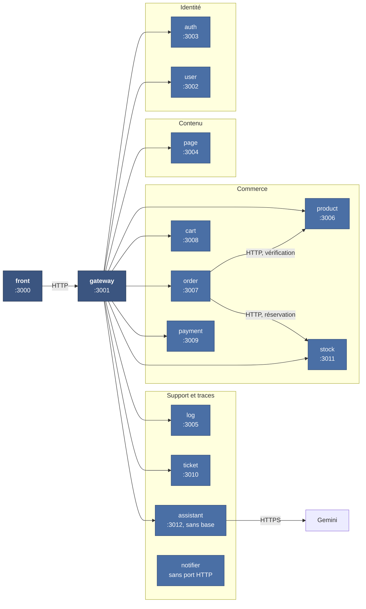
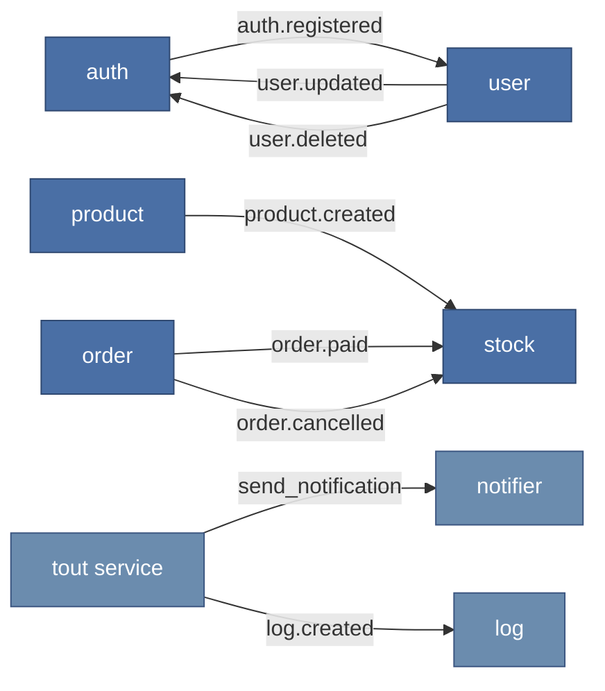

# Composants d'un site généré

Niveau 3 du modèle C4 : l'intérieur d'un site client.

## Les douze services et leurs ports (assistant activé)

`notifier-service` n'expose aucun port HTTP : il ne consomme que des événements. Il transforme un message en notification. L'assistant est également sans base PostgreSQL :
il charge le guide embarqué et appelle Gemini.

## La carte des événements

Ce que la passerelle ne montre pas : ce que les services se disent entre eux, sans passer par
elle.

| Événement | Émis par | Consommé par | Effet |
| --- | --- | --- | --- |
| `auth.registered` | auth | user | Crée le profil correspondant au compte |
| `user.updated` · `user.deleted` | user | auth | Répercute le changement sur les identifiants |
| `product.created` | product | stock | Ouvre une ligne de stock pour le produit |
| `order.paid` | order | stock | Confirme la réservation |
| `order.cancelled` | order | stock | Libère la réservation |
| `send_notification` | plusieurs | notifier | Envoie un courriel |
| `log.created` | plusieurs | log | Journalise |

**Aucun de ces échanges ne passe par la passerelle.** Elle route les requêtes venant du
navigateur. Ces événements complètent des appels HTTP synchrones : order attend product
et stock lors de la création de commande.

## Trois décisions lisibles sur ces schémas

### Le paiement n'est pas dans la carte des événements

`payment-service` n'émet ni ne consomme d'événement. Il parle à Stripe en HTTP et reçoit ses
webhooks en HTTP.

Un message perdu dans une file, c'est un log manquant ou un courriel non parti — désagréable,
rattrapable. Un paiement perdu, c'est une commande encaissée sans trace, ou une commande livrée
sans encaissement. La disponibilité du bus n'a pas à faire partie du chemin critique de l'argent.

Le lien reste asynchrone du point de vue du client — `order` passe en `paid` sur réception du
webhook, pas pendant la requête — mais le transport est direct et confirmé.

### Le stock combine réservation synchrone et événements

À la création d'une commande, order appelle stock en HTTP avec l'identifiant de commande
et les quantités. Un manque de stock ou un service indisponible fait échouer cette étape.
L'ajout au panier ne réserve rien. Le stock réagit ensuite à product.created, order.paid
et order.cancelled ; les réservations expirées sont libérées par une tâche périodique.

La confirmation après paiement est à terme : la commande peut être payée alors que sa
réservation n'est pas encore confirmée. Le bus reste donc nécessaire pour cette étape.

### Un service qui tombe n'en fait pas tomber d'autres

`log` et `notifier` sont hors de tout chemin synchrone. Ils peuvent être indisponibles sans
qu'aucun parcours client échoue : les messages s'accumulent dans RabbitMQ et sont traités au
redémarrage.

C'est la raison pour laquelle ces deux-là ne portent aucune donnée dont dépend une transaction.

## Ce que ces schémas ne disent pas

Ils décrivent **un** site. Ils ne montrent ni la multiplicité des tenants, ni les différences
d'isolation entre les deux forfaits — c'est l'objet du [diagramme de déploiement](deploiement.md),
et c'est là que se trouve un écart de sécurité relevé par l'audit.
