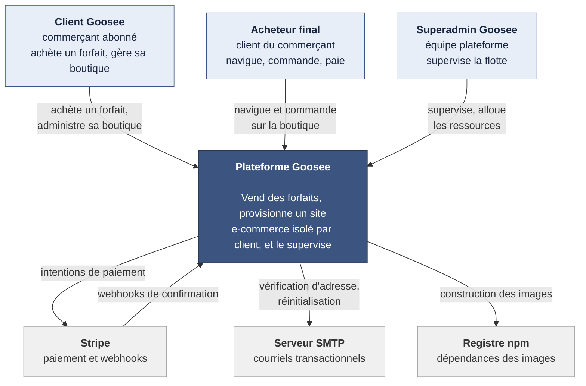
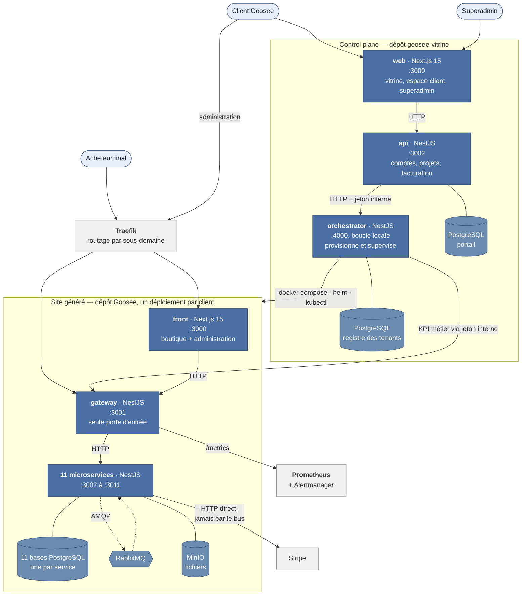

# Contexte et conteneurs

## Niveau 1 — Contexte

Qui se sert de Goosee, et avec quoi la plateforme dialogue à l'extérieur.

**Trois acteurs, trois usages distincts.** Le commerçant est le client payant ; l'acheteur ne
sait même pas que Goosee existe, il voit une boutique ; le superadmin ne touche jamais aux
données métier d'un client, il pilote de la capacité.

---

## Niveau 2 — Conteneurs

Les blocs déployables indépendamment. Deux ensembles : le **control plane**, unique, et les
**sites générés**, un par client.

### Ce que ce diagramme fixe

**Une seule porte d'entrée par site.** Le front ne parle qu'à la passerelle ; aucun microservice
n'est joignable directement. L'authentification, la validation et le contrôle de rôle vivent au
même endroit.

**Le control plane ne touche jamais aux données d'un client.** L'orchestrateur déploie et
interroge des indicateurs agrégés via le jeton interne du tenant. Il ne lit aucune base
métier — la supervision repose sur un point d'entrée `/internal/kpi` exposé par la passerelle,
pas sur un accès direct.

**L'orchestrateur n'écoute qu'en boucle locale.** Il exécute `docker`, `helm` et `kubectl` sur
l'hôte : c'est le composant le plus privilégié de la plateforme, et le seul que l'API du portail
peut joindre. Voir ANO-001 du registre des anomalies (dépôt `goosee-vitrine`).

**Le paiement sort du bus.** Les microservices communiquent en AMQP pour tout ce qui tolère
l'asynchrone. Stripe est appelé en HTTP direct : une intention de paiement perdue dans une file
serait une commande encaissée sans trace, ou l'inverse.

### Correspondance avec les dépôts

| Conteneur | Emplacement |
| --- | --- |
| `web`, `api`, `orchestrator` | `goosee-vitrine/apps/` |
| `front` | `Goosee/templates/front/` |
| `gateway` | `Goosee/templates/back/api-gateway/` |
| Les 11 services | `Goosee/templates/back/services/` |
| Traefik, Prometheus | `Goosee/docker/tenant/`, `Goosee/docker/observability/` |
