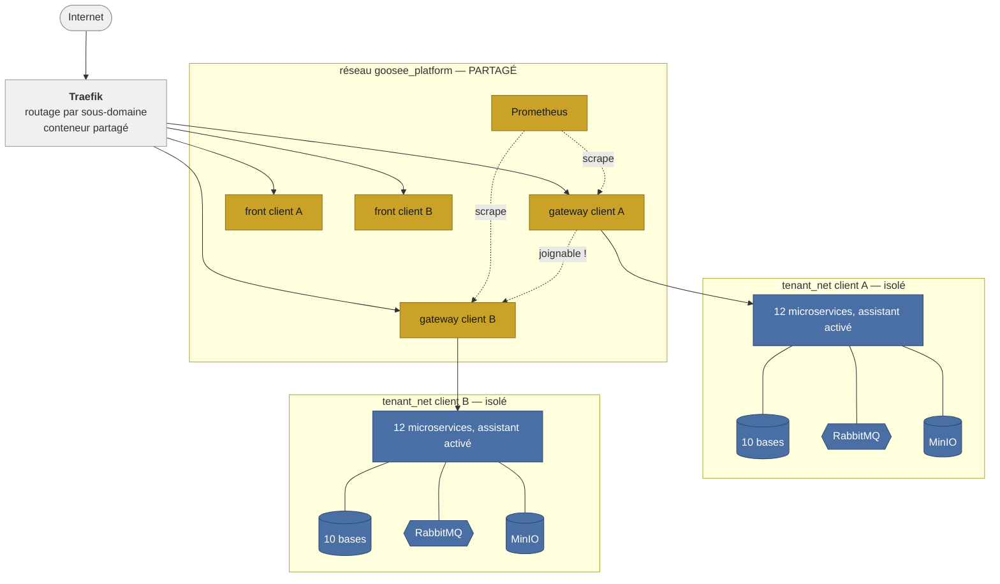
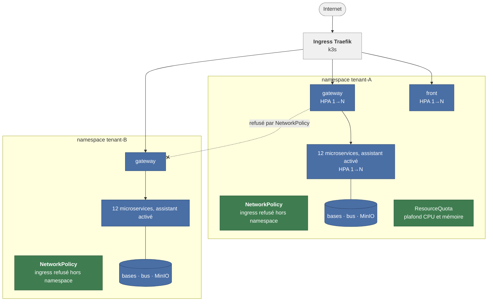

# Déploiement

Le forfait choisi détermine la cible d'infrastructure. Un seul orchestrateur pilote les deux,
derrière la même interface — mais **les deux ne se valent pas**, et ce document existe surtout
pour rendre cet écart visible.

Le cadre cible est un hébergement de production sur serveurs : Docker Compose
pour les tenants standard, Kubernetes/k3s pour les tenants du forfait scalable.
Le nombre d'hôtes et la topologie du stockage ne sont pas fixés par ces schémas.
Les valeurs plafonnées pour le portable et le cluster k3d décrivent seulement
la démonstration, pas le dimensionnement de production.

```
planInfra(plan) = plan === 'enterprise' ? 'k8s' : 'docker'
```

## Forfait standard — Docker Compose

Un projet Compose par client, avec ses propres bases, son stockage objet et ses secrets.



**Ce qui est isolé** : bases, bus de messages, stockage objet, volumes. Un client ne peut pas
lire les données d'un autre.

**Ce qui ne l'est pas** : les passerelles et les fronts de **tous** les clients partagent le
réseau `goosee_platform`, avec des alias DNS `<slug>-gateway`. La passerelle du client A résout
et joint directement celle du client B.

C'est nécessaire pour que Traefik et Prometheus les atteignent — mais la conséquence est que le
rayon d'explosion d'une passerelle compromise couvre toute la flotte. C'est
ANO-011 du registre des anomalies (dépôt `goosee-vitrine`), et la flèche jaune du schéma est
là pour qu'on ne puisse pas l'oublier.

## Forfait scalable — Kubernetes

Un namespace par client, déployé par chart Helm.



Trois garde-fous que le chemin Docker n'a pas :

| Objet | Rôle |
| --- | --- |
| `NetworkPolicy` | Refuse tout ingress hors du namespace, sauf depuis le contrôleur d'ingress |
| `ResourceQuota` | Plafonne CPU, mémoire et nombre de pods — un client ne peut pas consommer tout le cluster |
| `HorizontalPodAutoscaler` | Ajuste le nombre de réplicas sur l'usage CPU |

## L'écart entre les deux forfaits

| | Docker (standard) | Kubernetes (scalable) |
| --- | --- | --- |
| Bases, bus, stockage | isolés | isolés |
| **Réseau entre clients** | **partagé** | **refusé par NetworkPolicy** |
| Plafond de ressources | 0,5 CPU par conteneur dans le Compose tenant ; pas de quota mémoire global par tenant | `ResourceQuota` |
| Mise à l'échelle | manuelle | HPA automatique |
| Mise en veille | `compose stop` | réplicas à zéro |

Les deux dernières lignes sont des **différences de service assumées** : c'est ce qui distingue
les forfaits, le client sait ce qu'il achète.

La ligne en gras, non. Un client au forfait standard n'a pas choisi une isolation réseau plus
faible, et rien dans l'offre ne le lui dit. C'est un écart de conception, pas une option
commerciale — et c'est le forfait le moins cher qui est le moins protégé.

**Correction visée** : un réseau d'edge par client, rejoint uniquement par Traefik et
Prometheus, pour aligner le chemin Docker sur ce que la `NetworkPolicy` assure déjà côté
Kubernetes. Décision n° 3 de l'[audit du SI](../audit-si.md#6-traçabilité--du-constat-à-la-décision-darchitecture).

## Construction et limites de la démo

Le fichier `yarn.lock` est versionné et les images utilisent une installation figée.
Les 14 images de la démo ont été construites et testées localement le 17 septembre 2026.
L'ancien constat de lockfile absent reste consultable dans l'[audit historique](../audit-si.md).

Le launcher construit les images successivement avec un builder limité à 2 CPU et 4 Go.
Le serveur k3d est limité à 2 CPU et 5 Gio ; cela ne plafonne pas la consommation totale
hôte + Docker + vitrine. Les mises à jour des applications Helm utilisent `maxSurge: 0`
et `maxUnavailable: 1` : elles peuvent interrompre brièvement le service.
Voir le [guide de démo](../demo-infra.md) pour les commandes.

## Où regarder dans le dépôt

La [page résilience et reprise après panne](resilience-reprise.md) détaille les sondes,
les volumes persistants, les limites de disponibilité et les essais de récupération.
Elle décrit aussi la cible de sauvegarde des seules bases des sites vers Cloudflare
R2, qui reste à implémenter et à valider par une restauration.

| Élément | Fichier |
| --- | --- |
| Compose d'un tenant | `docker/tenant/docker-compose.tenant.yml` |
| Traefik et routes dynamiques | `docker/tenant/docker-compose.traefik.yml`, `docker/tenant/dynamic/` |
| Chart Helm | `k8s/goosee-tenant/` |
| Politique réseau, quota, autoscaling | `k8s/goosee-tenant/templates/{networkpolicy,resourcequota,hpa}.yaml` |
| Choix de la cible | `goosee-vitrine/apps/orchestrator/src/modules/tenant/plan-infra.ts` |
