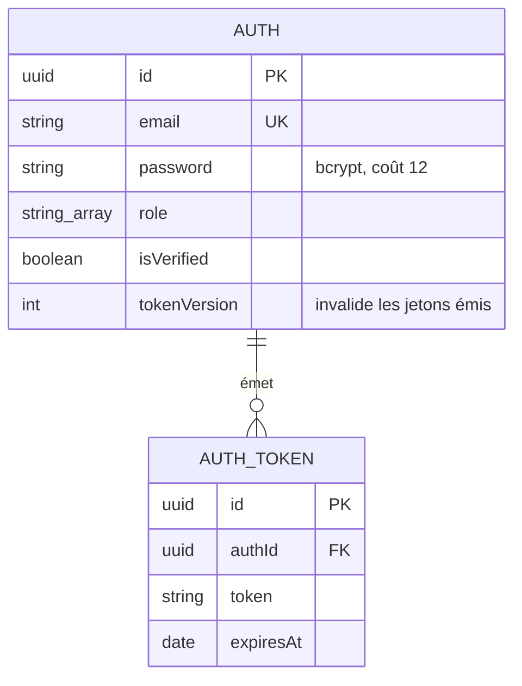
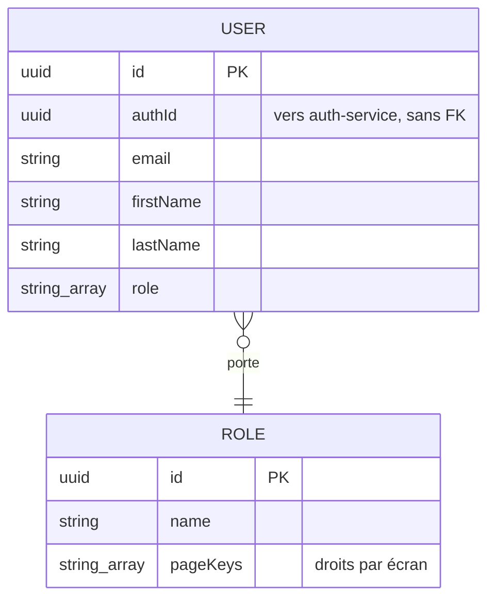
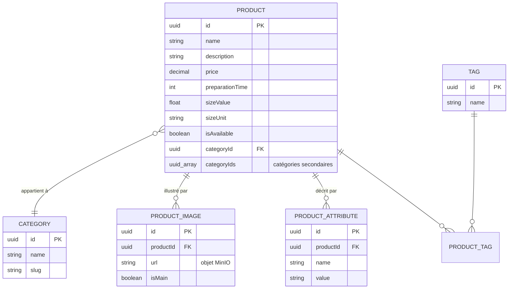
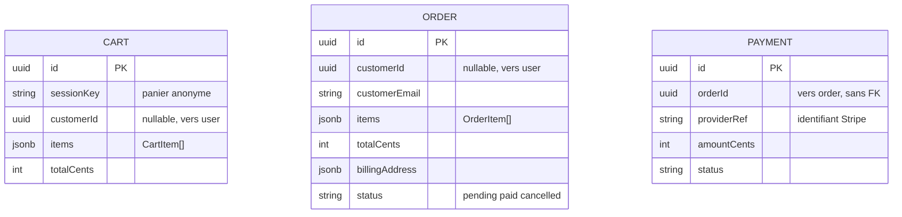
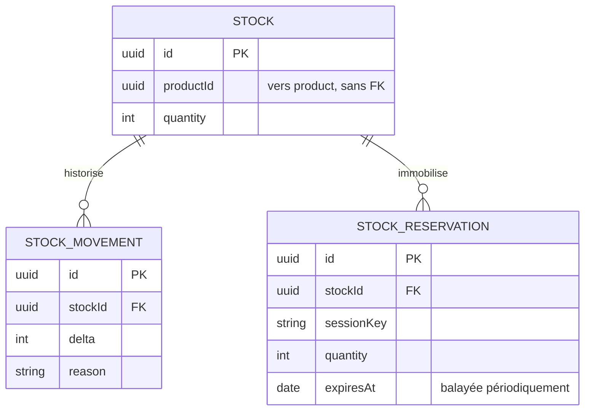
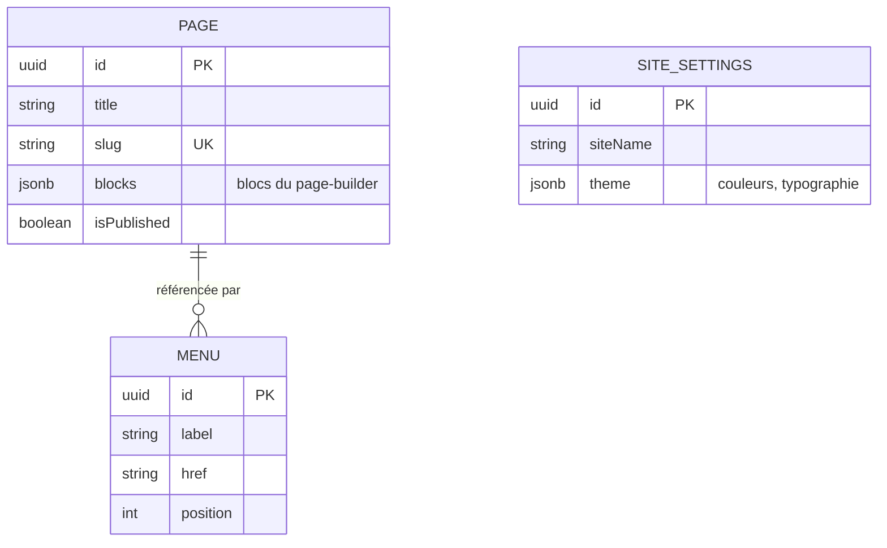
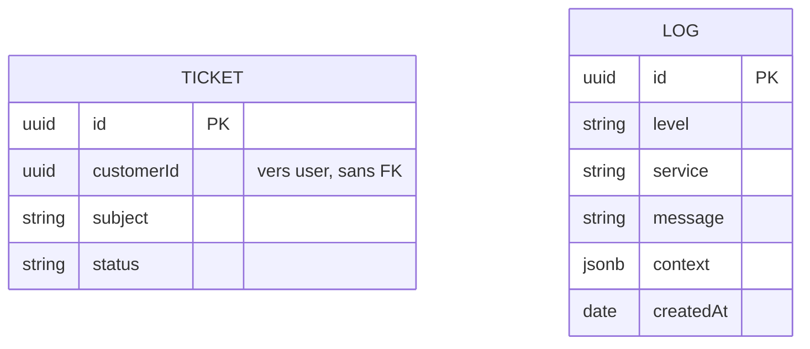
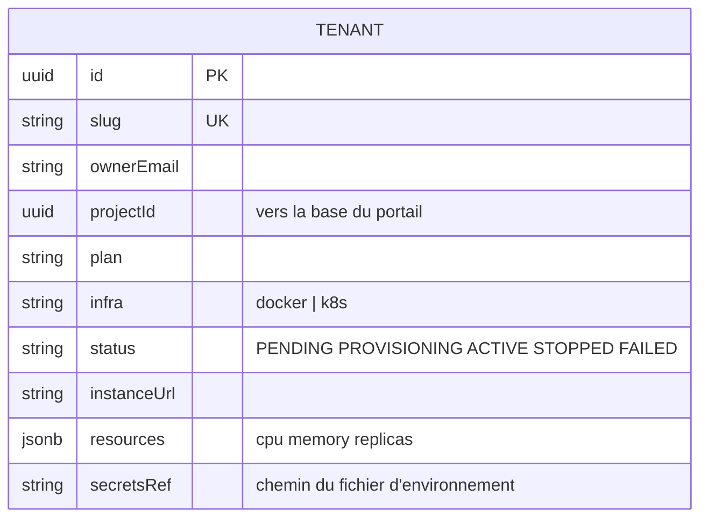

# Modèle de données

**Une base PostgreSQL par service persistant.** Aucune clé étrangère ne traverse une frontière de service :
les références croisées sont des UUID nus, que rien ne contraint au niveau du moteur.

Ce document montre donc **dix bases métier séparées pour un tenant**, pas un schéma d'ensemble — parce qu'il n'en
existe pas.

---

## Pourquoi aucun schéma global

Un schéma unique laisserait croire qu'on peut faire une jointure entre une commande et un
produit. On ne peut pas : ils vivent dans deux bases distinctes, sur deux conteneurs distincts.

Ce que ça coûte, ce que ça achète :

| | |
| --- | --- |
| **Coût** | Pas d'intégrité référentielle inter-services. Un `productId` peut pointer vers un produit supprimé. La cohérence est applicative, portée par les événements |
| **Gain** | Chaque service évolue, migre et se déploie seul. Un verrou sur la table des produits ne bloque pas les commandes. Une panne de la base des logs n'empêche pas de vendre |

Le compromis est assumé : c'est ce qui permet de déployer douze services indépendamment (dix avec une base, notifier et assistant sans base).

---

## Identité — `auth` et `user`





**Deux bases pour une même personne.** `auth` détient les identifiants, `user` le profil. La
synchronisation passe par `auth.registered`, `user.updated` et `user.deleted`.

Ce découpage isole les secrets : une fuite de la base `user` n'expose aucun mot de passe. Il
coûte en revanche une cohérence à terme entre les deux — un profil peut exister quelques
instants avant que ses identifiants ne soient à jour.

`tokenVersion` permet d'invalider d'un coup tous les jetons émis pour un compte, sans liste de
révocation.

---

## Catalogue — `product`

Le seul service dont le modèle est relationnel à l'intérieur.



---

## Commerce — `cart`, `order`, `payment`, `stock`





### La décision qui mérite d'être défendue : les lignes en `jsonb`

`cart.items` et `order.items` ne sont pas des tables liées. Ce sont des tableaux JSON qui
**recopient** le nom et le prix unitaire du produit au moment de l'ajout.

C'est volontaire, et pour deux raisons distinctes :

**Pour la commande, c'est une obligation.** Une commande est un document comptable. Si elle
pointait vers le produit par référence, un changement de prix six mois plus tard réécrirait le
montant d'une facture déjà émise. La copie fige ce qui a été vendu, à quel prix, sous quel nom.

**Pour le panier, c'est de la performance.** Afficher un panier ne demande aucun appel au
service produit : tout est dans la ligne. Contrepartie assumée — un prix modifié pendant qu'un
panier dort n'est pas répercuté. À la création de la commande, le code vérifie la disponibilité des produits et réserve le stock, mais calcule le total avec les prix unitaires reçus dans la requête. Il ne relit pas le prix du catalogue pour le substituer : cette limite du POC reste à corriger dans le code.

`stock_reservation` porte un `expiresAt` balayé chaque minute. La réservation est liée à une
commande créée au checkout, pas au panier ; elle expire après le délai configuré
(`STOCK_RESERVATION_TTL_MINUTES`, 30 minutes par défaut).

---

## Contenu et support — `page`, `ticket`, `log`





`page.blocks` contient le contenu produit par le page-builder. **C'est la donnée à l'origine
d'ANO-012** : elle est rendue en HTML sans assainissement, ce qui en fait un vecteur de XSS
stocké. Voir le registre des anomalies du dépôt `goosee-vitrine`.

`notifier-service` n'apparaît pas : il ne persiste rien, il consomme des événements et envoie
des courriels.

---

## Le registre du control plane

Une base à part, dans `goosee-vitrine`, qui ne contient aucune donnée métier de client.



`resources` est **l'allocation déclarée**, pas l'allocation appliquée. Rien ne garantit
aujourd'hui qu'elle corresponde à l'état du cluster : si `helm upgrade` échoue, la valeur est
enregistrée quand même. C'est la faiblesse F2 de l'[audit du SI](../audit-si.md#5-faiblesses-darchitecture) —
correction visée par la décision n° 7, réconciliation entre état déclaré et état réel.

---

## Où regarder dans le dépôt

```bash
find templates/back/services -name "*.entity.ts" | grep -v node_modules
```

Les migrations TypeORM de chaque service sont dans `src/migrations/`. Le schéma n'est jamais
créé par `synchronize` en production : chaque tenant démarre sur une base vierge dont le schéma
est monté par migrations versionnées.

Le service assistant ne possède pas de base PostgreSQL : il charge le guide embarqué et appelle Gemini.
