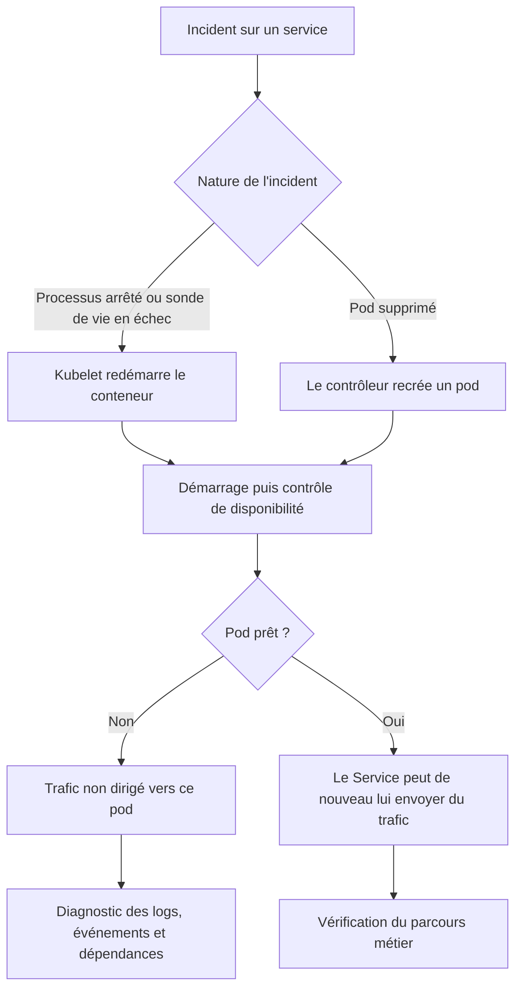
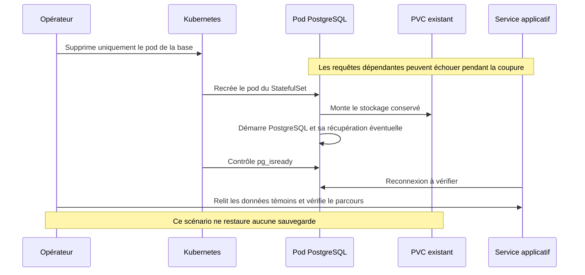

# Résilience et reprise après panne

État du POC au 17 septembre 2026 : Docker Compose pour Atelier Alice et k3s/k3d
pour Mode Bob, sur le même ordinateur. Le socle permet de redémarrer des processus
et de réutiliser leurs données persistantes. **Il ne garantit pas une disponibilité
continue ni une récupération après perte du disque.**

Cette page décrit les mécanismes présents dans les manifests et une procédure de
vérification. Les essais de panne ci-dessous sont **à exécuter** : les tests
[déjà consignés](../validation-poc-tests.md) couvrent le fonctionnement et une charge
légère, pas la récupération après panne. Aucun délai de reprise n'a été mesuré.

## Ce qui est en place

| Mécanisme | Docker Compose | k3s |
| --- | --- | --- |
| Processus arrêté accidentellement | `restart: unless-stopped` sur les services | Redémarrage du conteneur par kubelet, remplacement d'un pod par son contrôleur |
| Application bloquée | Les healthchecks renseignent l'état mais ne provoquent pas seuls un redémarrage | Sondes de démarrage et de vie sur gateway, services HTTP et front |
| Service pas encore prêt | Healthchecks sur plusieurs services | Sondes de disponibilité HTTP et `pg_isready` sur PostgreSQL |
| Données | Volumes du tenant | PVC des StatefulSets PostgreSQL, RabbitMQ et MinIO |
| Ressources | Limites du Compose | Requests/limits des workloads et quota du namespace |
| Échanges asynchrones | Files RabbitMQ déclarées durables | Même configuration applicative et stockage RabbitMQ persistant |

La sonde de disponibilité retire un pod non prêt des destinations du Service.
La sonde de vie peut faire redémarrer un conteneur bloqué, après ses seuils d'échec.
La gateway vérifie `/health`, sans garantie que toutes ses dépendances fonctionnent.
Les services HTTP utilisent `/health/ready` et leur contrôle de base de données.
Le notifier n'a pas de sonde applicative dans le chart ; RabbitMQ et MinIO n'y ont
pas non plus de sondes de santé. La couverture n'est donc pas uniforme.

Les files durables et les volumes ne garantissent pas à eux seuls un traitement
sans perte ni doublon. Les acquittements, la persistance des messages, les reprises
et l'idempotence doivent être vérifiés avant de revendiquer cette garantie.

## Reprise d'un service applicatif sur k3s



Avec un seul réplica, une interruption est possible pendant la reprise. Le HPA
ajuste la capacité selon le CPU ; il ne remplace pas une stratégie de haute
disponibilité. Les mises à jour utilisent `maxSurge: 0` et `maxUnavailable: 1`,
ce qui privilégie la mémoire disponible et peut également interrompre le service.

## Reprise d'une base avec son stockage conservé



Un volume persistant conserve les données au remplacement du pod ou du conteneur.
Ce n'est pas une sauvegarde : suppression du volume, corruption ou perte du disque
restent hors de cette protection. Conserver également les secrets associés,
notamment les fichiers de `docker/tenant/envs/`, sans les commiter ni les afficher.

## Limites assumées pour la démonstration

- L'ordinateur, Docker Desktop et le cluster local sont des points de panne communs.
  Aucun basculement vers une autre machine n'est configuré.
- Les bases, RabbitMQ et MinIO ont chacun un seul réplica dans le chart.
- Aucune sauvegarde automatisée ni procédure de restauration éprouvée n'est livrée.
  Le délai cible de reprise (RTO) et la perte de données admissible (RPO) ne sont pas définis.
- Une indisponibilité de Gemini affecte le chatbot. Son retour doit être vérifié
  séparément du parcours boutique.
- Une requête interrompue peut avoir été traitée avant la coupure. Vérifier l'état
  de la commande et du paiement avant de réessayer une action métier.

## Procédure légère de vérification

Exécuter les étapes **successivement**, sur le tenant de démonstration Mode Bob,
sans charge k6 ni reconstruction d'images. Garder un seul onglet de navigateur.
Les délais de 180 secondes ci-dessous bornent l'attente de la commande ; ils ne
constituent pas un engagement de reprise.

### 1. Relever l'état initial

```powershell
kubectl --context k3d-goosee get pods,pvc -n tenant-mode-bob
kubectl --context k3d-goosee get deployment product -n tenant-mode-bob
```

Vérifier que les pods sont prêts et les PVC liés. Dans la boutique et son
administration, noter l'identifiant, le nom et le prix d'un produit existant,
ainsi qu'une commande existante et son statut. Ne pas lancer de nouvel achat
pendant l'essai. Accès et comptes : [guide de démonstration](../demo-infra.md).

### 2. Remplacer un pod applicatif

```powershell
$productPods = kubectl --context k3d-goosee get pods -n tenant-mode-bob -l app.kubernetes.io/name=product -o json | ConvertFrom-Json
$productPod = $productPods.items | Select-Object -First 1
if (-not $productPod) { throw 'Aucun pod product trouvé' }
kubectl --context k3d-goosee delete pod $productPod.metadata.name -n tenant-mode-bob
kubectl --context k3d-goosee rollout status deployment/product -n tenant-mode-bob --timeout=180s
kubectl --context k3d-goosee get pods -n tenant-mode-bob -l app.kubernetes.io/name=product
```

Confirmer le remplacement du pod, puis ouvrir le catalogue et le produit témoin.
Noter la durée d'indisponibilité observée, ou l'absence de coupure visible.
Ce test démontre la recréation du pod ; il ne teste pas le déclenchement d'une
sonde de vie sur une application bloquée.

### 3. Redémarrer la base produits en conservant le PVC

```powershell
kubectl --context k3d-goosee delete pod product-db-0 -n tenant-mode-bob
kubectl --context k3d-goosee wait --for=condition=Ready pod/product-db-0 -n tenant-mode-bob --timeout=180s
kubectl --context k3d-goosee get pods,pvc -n tenant-mode-bob
```

Si le pod n'est pas encore recréé lorsque `wait` démarre, vérifier son apparition
avec `get pods`, puis relancer l'attente. Ne supprimer ni PVC, ni namespace,
ni cluster. Relire le produit témoin : identifiant, nom et prix doivent être
identiques. Vérifier aussi le retour du catalogue et de la commande témoin.
Ne pas lancer le seed entre les relevés : il pourrait masquer une perte de données.

### 4. Si la reprise échoue

```powershell
kubectl --context k3d-goosee get events -n tenant-mode-bob --sort-by=.lastTimestamp
kubectl --context k3d-goosee logs deployment/product -n tenant-mode-bob --tail=80
kubectl --context k3d-goosee logs pod/product-db-0 -n tenant-mode-bob --tail=80
kubectl --context k3d-goosee describe pod product-db-0 -n tenant-mode-bob
```

Chercher un manque de mémoire, une image absente, un PVC non monté ou un échec
de connexion. Si la base est prête mais le service ne se reconnecte pas, un
`kubectl --context k3d-goosee rollout restart deployment/product -n tenant-mode-bob`
est une reprise manuelle possible. La consigner comme telle, puis vérifier de
nouveau la disponibilité et les données. Éviter les redémarrages globaux répétés.

### 5. Après arrêt de Docker Desktop ou du PC

Redémarrer Docker Desktop et attendre sa disponibilité. Si le cluster existe mais
est arrêté, utiliser `k3d cluster start goosee`. Vérifier les pods avant de relancer
les contrôles du [guide de démonstration](../demo-infra.md). Un service Compose
explicitement arrêté peut nécessiter une relance manuelle.

La commande de présentation avec `--skip-build` peut remettre la démo en route,
mais elle exécute aussi le seed : elle ne prouve pas la conservation des données.
Après perte du stockage, le seed permet seulement de recréer des exemples ; les
données antérieures ne sont pas récupérées par ce mécanisme.

## Consigner le résultat

Ajouter à la [validation POC](../validation-poc-tests.md) la date, le commit,
le scénario, le délai observé, les données comparées et toute intervention manuelle.
Ne marquer un scénario réussi qu'après vérification applicative et des données.

| Scénario | État à la rédaction |
| --- | --- |
| Remplacement du pod product | À exécuter |
| Redémarrage de product-db avec conservation des données | À exécuter |
| Reprise après arrêt du PC | Non validée dans cette passe |
| Restauration après perte du disque | Non couverte |

## Références d'implémentation

- [Workloads et sondes](../../k8s/goosee-tenant/templates/workloads.yaml).
- [PostgreSQL et PVC](../../k8s/goosee-tenant/templates/databases.yaml).
- [RabbitMQ et MinIO](../../k8s/goosee-tenant/templates/infra.yaml).
- [Valeurs et ressources du chart](../../k8s/goosee-tenant/values.yaml).
- [Compose des tenants](../../docker/tenant/docker-compose.tenant.yml).
- [Déploiement et isolation](deploiement.md).
