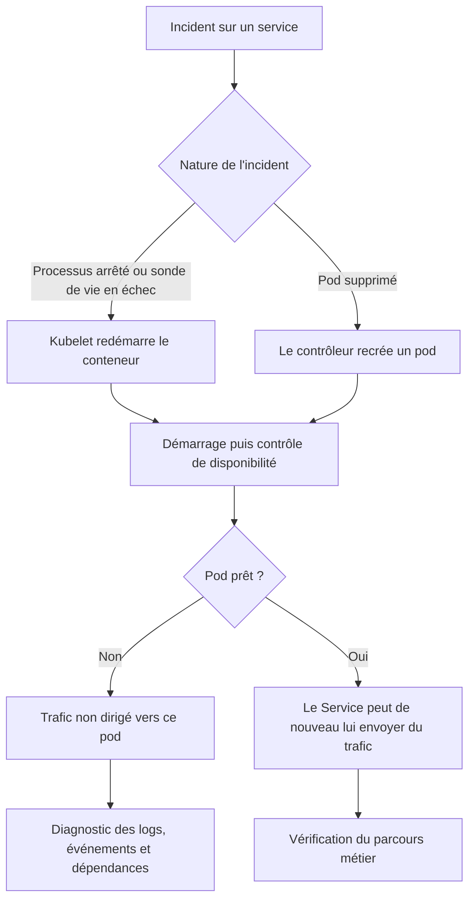
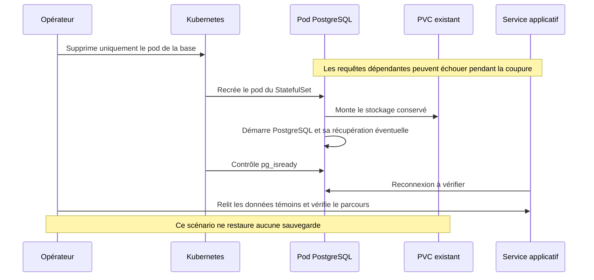
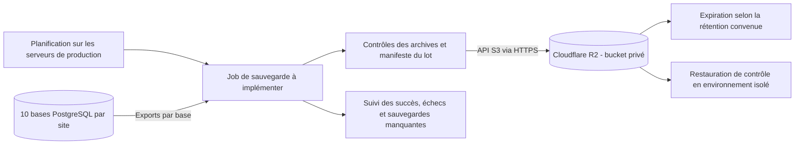
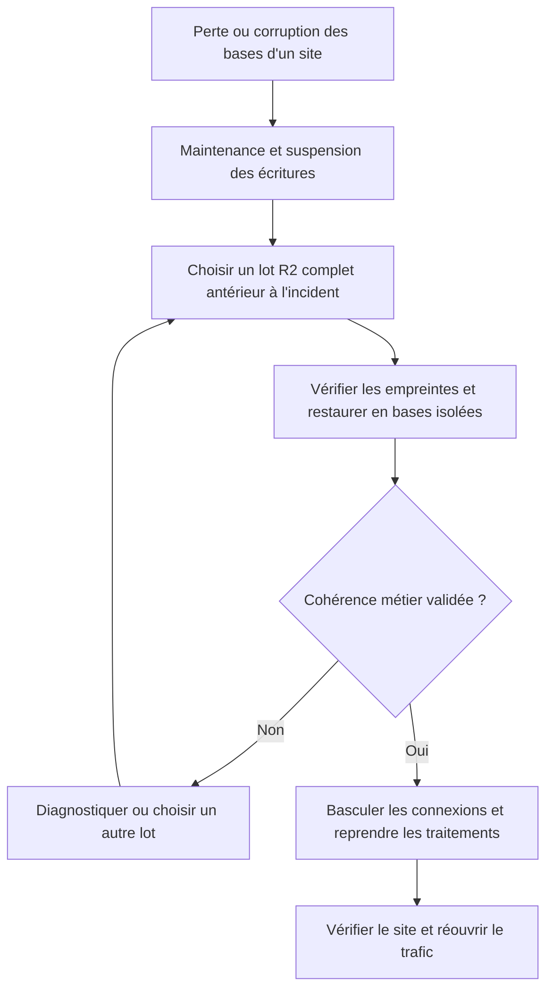
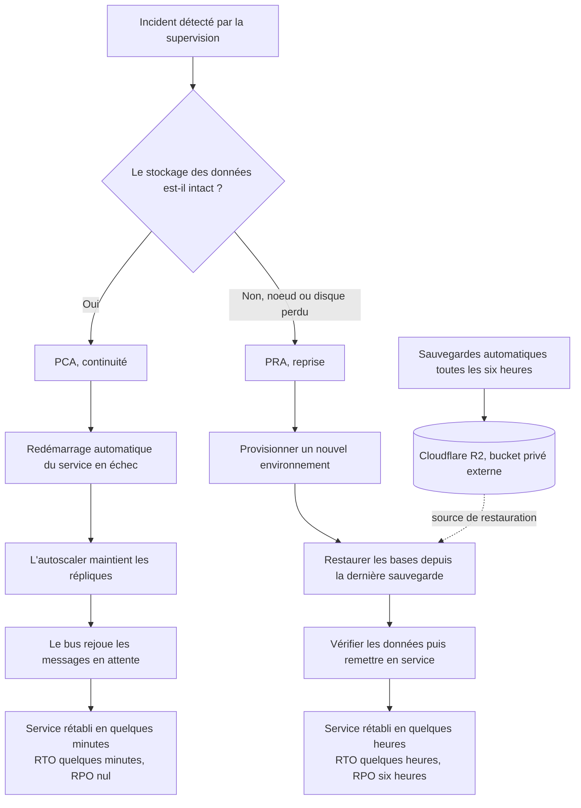
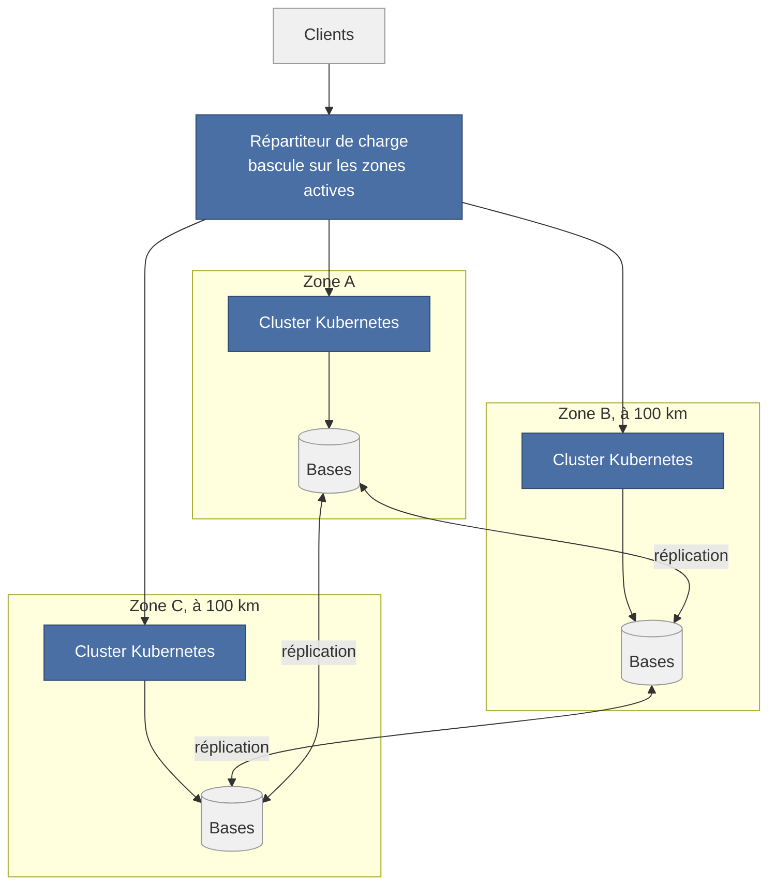

# Résilience et reprise après panne en production

Cette page décrit les sites clients hébergés sur des serveurs Docker Compose ou
un cluster Kubernetes/k3s. Elle ne suppose pas un hébergement sur un PC.
Les commandes propres à la démonstration sont dans une
[annexe locale](reprise-tests-locaux.md).

**Statut au 17 septembre 2026 :** les sondes, redémarrages et volumes décrits
ci-dessous existent dans les manifests. La sauvegarde des bases vers Cloudflare R2
est la cible retenue, mais aucun job de sauvegarde ni restauration R2 n’est encore
livré dans le dépôt. Les tests locaux consignés ne certifient pas la production.

## Mécanismes présents dans les manifests

| Mécanisme | Docker Compose | k3s |
| --- | --- | --- |
| Processus arrêté accidentellement | `restart: unless-stopped` sur les services | Redémarrage du conteneur par kubelet, remplacement d'un pod par son contrôleur |
| Application bloquée | Les healthchecks renseignent l'état mais ne provoquent pas seuls un redémarrage | Sondes de démarrage et de vie sur gateway, services HTTP et front |
| Service pas encore prêt | Healthchecks sur plusieurs services | Sondes de disponibilité HTTP et `pg_isready` sur PostgreSQL |
| Données | Volumes du tenant | PVC des StatefulSets PostgreSQL, RabbitMQ et MinIO |
| Ressources | Limites du Compose | Requests/limits des workloads et quota du namespace |
| Échanges asynchrones | Files RabbitMQ déclarées durables | Même configuration applicative et stockage RabbitMQ persistant |

La sonde de disponibilité retire un pod non prêt des destinations du Service.
La sonde de vie peut faire redémarrer un conteneur bloqué, après ses seuils d'échec.
La gateway vérifie `/health`, sans garantie que toutes ses dépendances fonctionnent.
Les services HTTP utilisent `/health/ready` et leur contrôle de base de données.
Le notifier n'a pas de sonde applicative dans le chart ; RabbitMQ et MinIO n'y ont
pas non plus de sondes de santé. La couverture n'est donc pas uniforme.

Les files durables et les volumes ne garantissent pas à eux seuls un traitement
sans perte ni doublon. Les acquittements, la persistance des messages, les reprises
et l'idempotence doivent être vérifiés avant de revendiquer cette garantie.

## Reprise d'un service applicatif sur k3s

Avec un seul réplica, une interruption est possible pendant la reprise. Le HPA
ajuste la capacité selon le CPU ; il ne remplace pas une stratégie de haute
disponibilité. Les mises à jour utilisent `maxSurge: 0` et `maxUnavailable: 1`,
ce qui privilégie la mémoire disponible et peut également interrompre le service.
Ces valeurs viennent du profil de démonstration : le dimensionnement et la stratégie
de mise à jour de production doivent être définis pour le niveau de disponibilité visé.

## Reprise d'une base avec son stockage conservé

Un volume persistant conserve les données au remplacement du pod ou du conteneur.
Ce n'est pas une sauvegarde : suppression du volume, corruption ou perte du disque
restent hors de cette protection. Conserver également les secrets associés,
notamment les fichiers de `docker/tenant/envs/`, sans les commiter ni les afficher.

## Sauvegardes des bases des sites vers Cloudflare R2

### Périmètre retenu

La cible est un bucket privé Cloudflare R2, extérieur aux serveurs qui hébergent les
sites. Chaque campagne sauvegarde **les dix bases PostgreSQL de chaque site** :
auth, user, page, log, product, order, cart, payment, stock et ticket. Une campagne
doit traiter l'inventaire réel des tenants pour inclure les nouveaux sites.

Cette politique couvre uniquement les bases des sites. Les objets MinIO (images,
documents), les messages RabbitMQ, les bases du portail et de l'orchestrateur,
les secrets et la configuration d'hébergement ne font pas partie de ces archives.
Une restauration des bases peut donc retrouver des références vers des fichiers
perdus. **Cette politique ne suffit pas à restaurer intégralement la plateforme.**

### Fréquence et rétention

Politique confirmée pour chaque site :

| Ancienneté du point de sauvegarde | Points conservés |
| --- | --- |
| Jusqu'à 14 jours | Quatre sauvegardes par jour, espacées de six heures |
| Au-delà de 14 jours et jusqu'à un mois | Une sauvegarde quotidienne |
| Au-delà d'un mois | Expiration des archives |

Convention d'implémentation : un mois correspond à 30 jours de rétention.
Planifier les campagnes à 00:00, 06:00, 12:00 et 18:00 UTC. Conserver celle de
00:00 dans une classe `daily-30d` dès sa création et les trois autres dans
`intraday-14d`. Appliquer les expirations respectives à 30 et 14 jours depuis
la création des objets. Les quatorze premiers jours disposent ainsi de quatre
points quotidiens, puis d'un seul jusqu'au trentième jour, sans copie tardive
qui repousserait artificiellement la date d'expiration.

Si la campagne de 00:00 échoue, le job doit sélectionner la première campagne
complète suivante du jour pour `daily-30d` et signaler le point manquant.
La fréquence et la rétention sont décidées ; leur automatisation reste à implémenter.

Le job réalise les exports et les envoie ; R2 conserve les objets. Les règles
d'expiration peuvent s'appliquer par préfixe et supprimer les archives arrivées
à échéance. Une règle de cycle de vie ne choisit pas automatiquement un point
quotidien parmi plusieurs sauvegardes : cette sélection relève du job.
La suppression n'est pas instantanée à l'échéance.
Voir les [règles de cycle de vie R2](https://developers.cloudflare.com/r2/buckets/object-lifecycles/).

### Chaîne de sauvegarde à implémenter

Le job peut être un CronJob Kubernetes ou une tâche planifiée sur les hôtes Compose.
Son emplacement et son déploiement restent à implémenter. Il doit :

1. Inventorier les sites et leurs bases, puis identifier chaque campagne par un
   horodatage UTC et un identifiant unique. Éviter le chevauchement des campagnes.
2. Produire un export logique par base avec `pg_dump` au format custom, avec un
   client compatible avec la version PostgreSQL. Traiter les bases successivement
   et borner les ressources du job pour limiter l'impact sur les sites.
3. Contrôler les codes de sortie, la lisibilité des archives et leur empreinte
   SHA-256. Ces contrôles ne remplacent pas une restauration réelle.
4. Envoyer les archives sous des clés uniques, par exemple
   `production/<classe-retention>/<tenant>/<campagne>/<base>.dump`, sans écraser
   la sauvegarde précédente. Utiliser un bucket privé et des identifiants dédiés,
   conservés dans le gestionnaire de secrets de l'environnement.
5. Publier le manifeste de réussite d'un site seulement après vérification de ses
   dix archives distantes. Y noter versions, heures de début/fin, bases, empreintes
   et résultats. Un lot incomplet ne doit pas être proposé comme restauration complète.
6. Alerter sur un échec, un lot incomplet ou l'absence de sauvegarde récente pour
   un site. Reprendre les envois en échec sans remplacer les derniers lots valides.

R2 expose une [API compatible S3](https://developers.cloudflare.com/r2/api/) pour
ces transferts. Aucun bucket ni identifiant Cloudflare n'est créé par cette documentation.

`pg_dump` fournit une vue cohérente d'une base, mais des exports indépendants ne
constituent pas un instantané atomique des dix bases. Pour obtenir un lot cohérent
à l'échelle d'un site, prévoir une fenêtre où les écritures et les traitements
asynchrones sont suspendus après stabilisation des opérations en cours, ou définir
et tester une procédure de réconciliation métier. Ce choix reste à implémenter.
Les rôles globaux PostgreSQL doivent être recréés par le provisioning : ils ne
font pas partie d'un dump de base. Voir la
[documentation PostgreSQL de pg_dump](https://www.postgresql.org/docs/16/app-pgdump.html).

## Procédure de reprise en production

### Service ou base indisponible, stockage intact

1. Identifier le site, le composant et l'étendue de la panne avec la supervision,
   les événements et les logs. Vérifier ressources, réseau, stockage et dépendances.
2. Laisser agir le redémarrage prévu par le runtime, puis contrôler disponibilité
   et parcours métier. Avec un seul réplica, la coupure reste visible.
3. Si la reprise automatique échoue, corriger la cause avant un redémarrage ciblé.
   Conserver les volumes et les secrets ; consigner toute intervention manuelle.
4. Vérifier les opérations interrompues avant de rejouer un paiement ou une commande.

### Hôte ou nœud perdu

Rétablir l'hôte ou préparer un hôte de remplacement avec les versions applicatives,
la configuration et les secrets attendus. Sur Kubernetes, le déplacement d'un pod
ne garantit pas l'accès à ses données : un volume attaché au nœud perdu peut rester
inaccessible. La topologie et la réplication du stockage doivent être établies.
Si les volumes sont disponibles, les rattacher selon la procédure du stockage ;
sinon, suivre la restauration des bases ci-dessous.

### Bases perdues ou corrompues : restauration depuis R2

Cette procédure est la cible d'exploitation, à éprouver avant la mise en service
du mécanisme de sauvegarde.

1. Mettre le site concerné en maintenance et suspendre producteurs, consommateurs
   et traitements planifiés qui pourraient écrire pendant la restauration.
2. Choisir un lot complet antérieur à l'incident. Relever son horodatage et la
   perte de données potentielle depuis ce point. Préserver l'état endommagé pour analyse.
3. Télécharger les dix archives et le manifeste depuis R2, puis vérifier leurs
   empreintes et la compatibilité des versions PostgreSQL et applicatives.
4. Recréer les rôles nécessaires et restaurer avec `pg_restore` dans des bases
   neuves isolées. Ne pas écraser les bases actives pour un essai de restauration.
5. Contrôler les relations métier : comptes auth/user, commandes/paiements,
   réservations/stock et références aux fichiers. Réconcilier les événements ou
   webhooks reçus après le point restauré avec l'état réel du prestataire de paiement.
6. Basculer le site vers les bases restaurées après validation, puis reprendre les
   traitements sans rejouer aveuglément les messages. Vérifier connexion,
   catalogue, commandes, stock et tickets avant la réouverture du trafic.
7. Consigner la durée, le point restauré, les données perdues et les contrôles.

## Disponibilité et objectifs de reprise

Le chart actuel conserve un seul réplica par base, pour RabbitMQ et pour MinIO.
La présence de Kubernetes ne prouve ni une topologie multi-nœuds, ni un stockage
répliqué, ni un basculement automatique opérationnel. Les points de panne communs
sont les hôtes, le stockage, l'entrée réseau et les dépendances partagées.

Le RPO est la perte de données admissible, le RTO le délai de remise en service.
Ils restent à fixer et mesurer. Les quatre campagnes quotidiennes retenues
ont un intervalle nominal de six heures ; un échec de sauvegarde
ou la durée d'export augmente l'ancienneté du dernier point récupérable. Ce n'est
pas une garantie de RPO. Les dumps décrits ne permettent pas une restauration à
n'importe quelle seconde entre deux campagnes.

## Continuité et reprise : PCA, PRA, RTO et RPO

Le plan de continuité d'activité (PCA) décrit comment le service tient malgré un
incident. Le plan de reprise d'activité (PRA) décrit comment on repart après un
sinistre qui a arrêté le service. Le RPO (objectif de point de reprise) est la perte
de données admissible, mesurée en temps. Le RTO (objectif de temps de reprise) est
le délai maximal de remise en service. Les valeurs ci-dessous sont des cibles de
production, conditionnées par la mise en place du job de sauvegarde décrit plus haut.

Deux situations se distinguent, selon que le stockage est intact ou perdu.

| Objectif | Cible | Sur quoi il repose |
| --- | --- | --- |
| RTO service ou base, stockage intact | Quelques minutes | Reprise automatique et redémarrage orchestré |
| RTO perte d'un noeud ou du disque | Quelques heures | Restauration depuis la dernière sauvegarde externe |
| RPO | Six heures | Quatre sauvegardes par jour espacées de six heures |

Limite assumée. Les images du catalogue ne sont pas encore sauvegardées, une
restauration peut donc pointer vers des fichiers manquants. Ces objectifs sont des
cibles, non une garantie tant que le job de sauvegarde et la restauration ne sont
pas implémentés et éprouvés.

## Architecture cible en haute disponibilité (trois zones)

Le déploiement actuel tient sur un seul site, un cluster local à un noeud. La perte
de ce site, incendie, coupure réseau ou panne électrique, arrête toutes les boutiques
en même temps. C'est le point unique de défaillance le plus lourd, et la présence de
Kubernetes ne suffit pas à le lever.

La cible de production répartit la charge sur trois zones géographiques distinctes,
séparées d'au moins cent kilomètres. Une zone est un centre de données autonome, avec
sa propre alimentation et son propre réseau. La distance évite qu'un même sinistre
régional touche deux zones à la fois. Les bases sont répliquées entre les zones, un
répartiteur de charge dirige le trafic vers les zones actives, et si une zone tombe,
les deux autres prennent le relais. Le cluster s'étend sur les trois zones, et ses
règles de placement évitent de concentrer toutes les répliques d'un service au même
endroit.

Cette topologie survit à la perte complète d'une zone et rend atteignables les
objectifs RTO et RPO ci-dessus. Elle reste une cible, le contexte scolaire ne
disposant que d'un cluster local à un noeud.

## Validation attendue avant exploitation

| Scénario | Critère | État |
| --- | --- | --- |
| Reprise d'un service | Disponibilité et parcours métier rétablis, durée relevée | À tester sur l'environnement cible |
| Redémarrage d'une base | Données témoins identiques, reconnexion applicative | À tester sur l'environnement cible |
| Campagne R2 | Dix archives vérifiées par site, manifeste complet, échecs signalés | À implémenter |
| Rétention | Quatre points par jour sur 14 jours, puis un point quotidien jusqu'à 30 jours, règles vérifiées sur un bucket de test | Politique confirmée, automatisation à implémenter |
| Restauration R2 | Lot restauré en isolation et cohérence métier contrôlée | À implémenter et éprouver |
| Perte d'un hôte | Accès au stockage ou restauration, délai et pertes mesurés | À tester sur l'environnement cible |

Les [résultats du POC](../validation-poc-tests.md) et les
[essais locaux de reprise](reprise-tests-locaux.md) restent des références distinctes.
Une suppression volontaire de pod se teste d'abord en préproduction, dans une
fenêtre maîtrisée ; les noms et contextes k3d de la démo ne sont pas ceux de production.

## Références d'implémentation

- [Workloads et sondes](../../k8s/goosee-tenant/templates/workloads.yaml).
- [PostgreSQL et PVC](../../k8s/goosee-tenant/templates/databases.yaml).
- [RabbitMQ et MinIO](../../k8s/goosee-tenant/templates/infra.yaml).
- [Valeurs et ressources du chart](../../k8s/goosee-tenant/values.yaml).
- [Compose des tenants](../../docker/tenant/docker-compose.tenant.yml).
- [Déploiement et isolation](deploiement.md).
