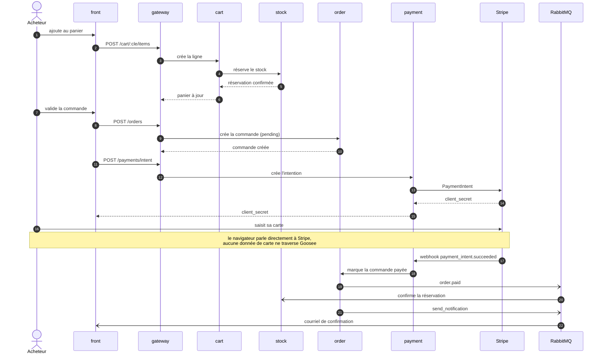
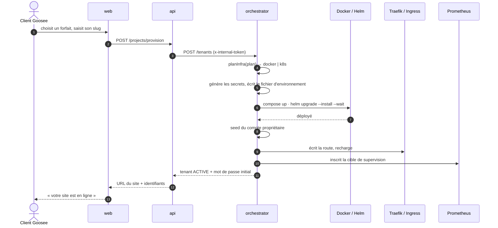
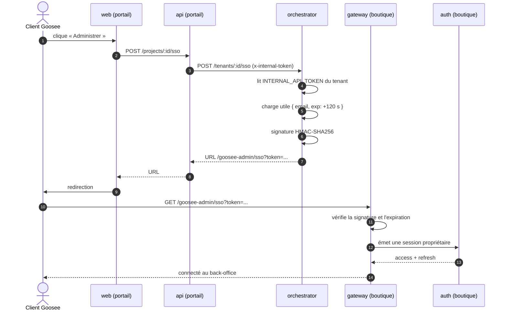

# Séquences

Trois parcours, choisis parce qu'ils traversent chacun une frontière différente : le premier
va du navigateur jusqu'à Stripe, le deuxième du portail jusqu'à l'infrastructure, le troisième
franchit la limite entre deux systèmes d'authentification.

---

## Parcours d'achat

Du panier à la commande payée. C'est le scénario couvert par la suite de bout en bout
`templates/back/api-gateway/test/parcours-achat.e2e-spec.ts`.

**Ce que la séquence protège.** Le stock est réservé **à l'ajout au panier**, pas au paiement :
deux acheteurs ne peuvent pas acheter le dernier article simultanément. La réservation est
confirmée sur `order.paid` et libérée sur `order.cancelled`.

**Ce qui ne traverse jamais la plateforme.** Les données de carte vont du navigateur à Stripe
directement. Goosee ne manipule qu'un `client_secret` et un identifiant d'intention — ce qui
sort la plateforme du périmètre de conformité le plus lourd.

**Pourquoi le webhook et pas une réponse synchrone.** L'acheteur peut fermer son onglet pendant
l'authentification de sa banque. Le webhook arrive quand même, et la commande passe à `paid`.
Un `payment-service` qui attendrait la réponse dans le cycle HTTP perdrait ces cas-là.

---

## Provisionnement d'un client

Du choix du forfait au site en ligne.

### Trois faiblesses que ce schéma rend visibles

**L'attente est dans le cycle HTTP.** `helm --wait --timeout 6m` : la requête du client peut
durer six minutes. Aucune file de travaux, aucune reprise, aucune progression affichée.

**Aucune compensation en cas d'échec.** Si une étape échoue après la génération des secrets, le
tenant est marqué `FAILED` mais le fichier d'environnement, le projet Compose partiellement
monté, la route Traefik et la cible de supervision **subsistent**. L'API renvoie pourtant
`201` : le client croit son site créé.

**Le rechargement de Traefik est global.** Sur le chemin Docker, `writeRouteAndReload` redémarre
le conteneur Traefik partagé — créer le douzième client interrompt brièvement les onze autres.

Ce sont les faiblesses F1, F3 et F4 de l'[audit du SI](../audit-si.md#5-faiblesses-darchitecture).
Correction visée : décision n° 7 — provisionnement asynchrone réconcilié.

---

## Auto-connexion à l'administration

Le client clique « Administrer » depuis son espace et arrive connecté sur le back-office de sa
boutique. Deux systèmes d'authentification distincts, aucun mot de passe transmis.

**Le secret partagé n'est pas un mot de passe.** L'orchestrateur signe avec
l'`INTERNAL_API_TOKEN` du tenant, qu'il connaît pour l'avoir généré. La boutique vérifie avec le
même secret. Aucun identifiant utilisateur ne circule.

**Deux limites connues.** Le jeton voyage en paramètre d'URL — donc dans l'historique du
navigateur, l'en-tête `Referer` et les journaux de proxy. Et le commentaire du code annonce un
usage unique qui n'est pas implémenté : il n'y a ni nonce ni stockage de rejeu, seulement une
expiration à 120 secondes.

Constat ouvert au registre des anomalies du dépôt `goosee-vitrine`.
