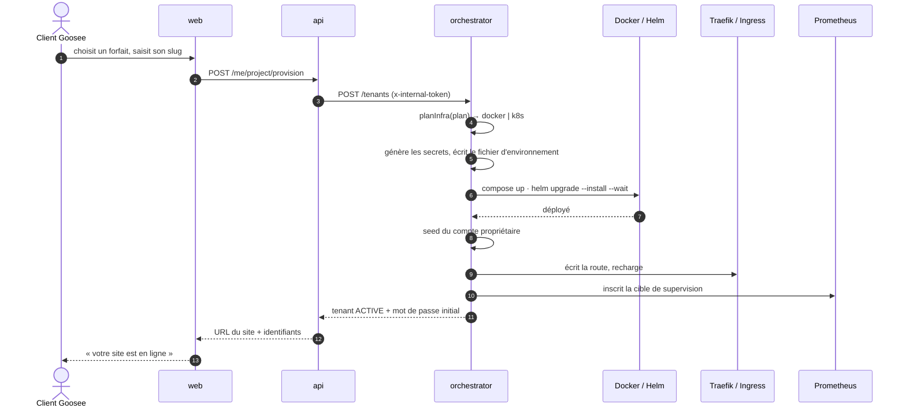
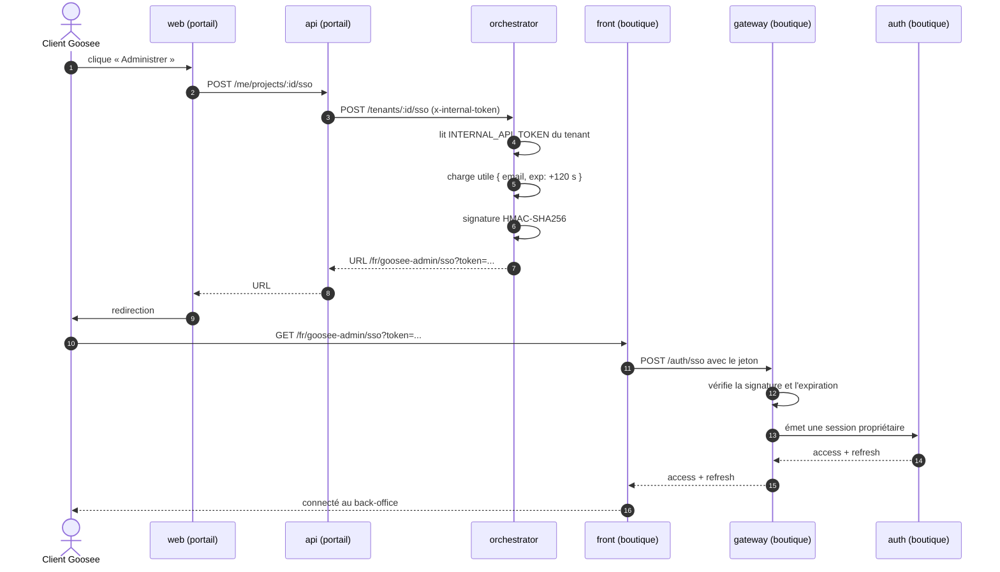

# Séquences

État des parcours au 17 septembre 2026. Le parcours d'achat de la démo utilise le
prestataire simulé ; le mode Stripe reste disponible hors de cette configuration.
Le provisioning en direct et le SSO ci-dessous ne font pas partie de la dernière
[répétition validée](../validation-poc-tests.md).

## Parcours d'achat

Le test HTTP `templates/back/api-gateway/test/parcours-achat.e2e-spec.ts` vérifie
le parcours simulé, précédé de l'inscription et de la vérification d'email.

```mermaid
sequenceDiagram
    autonumber
    actor A as Acheteur
    participant F as Front
    participant G as Gateway
    participant CA as Cart
    participant O as Order
    participant PR as Product
    participant ST as Stock
    participant P as Payment
    participant S as Stripe
    participant B as RabbitMQ

    A->>F: Ajoute au panier
    F->>G: POST /cart/:sessionKey/items
    G->>CA: Enregistre les lignes et le total
    CA-->>F: Panier à jour (via gateway)
    Note over CA,ST: Aucun stock réservé au panier

    A->>F: Valide ses coordonnées
    F->>G: POST /orders
    G->>O: Crée une commande
    O->>PR: Vérifie la disponibilité des produits
    O->>ST: HTTP POST /stock/reserve (orderId, quantités)
    ST-->>O: Réservation ou erreur de stock
    O->>O: Enregistre la commande pending
    O-->>F: Commande créée (via gateway)
    F->>G: POST /payments
    G->>P: Crée l'intention

    alt Démonstration avec paiement simulé
        P-->>F: Référence pi_mock_ (via gateway)
        F->>G: POST /payments/webhook (succeeded)
        G->>P: Transmet le webhook simulé
    else Stripe configuré
        P->>S: Crée un PaymentIntent
        S-->>P: client_secret
        P-->>F: client_secret (via gateway)
        A->>S: Saisie de carte via Stripe dans le navigateur
        S->>G: POST /payments/webhook signé
        G->>P: Transmet corps brut et signature
    end

    P->>O: HTTP PATCH statut paid
    O-)B: order.paid
    B-)ST: Confirme la réservation
    Note over O,ST: order.cancelled libère la réservation ; expiration selon TTL
```

Le stock est réservé à la **création de la commande**, avant le paiement. Le panier
ne bloque aucune quantité. Le délai de réservation est configurable (30 minutes par
défaut), avec une purge chaque minute. La confirmation après paiement est asynchrone.

Le total de commande est calculé avec les prix unitaires reçus dans la requête :
la disponibilité est vérifiée, mais le prix catalogue n'est pas substitué côté serveur.
C'est une limite actuelle du code, détaillée dans le [modèle de données](modele-donnees.md).
La mise à jour de statut émet les événements stock ; elle n'émet pas actuellement
un événement d'email de confirmation de commande.

En mode Stripe, les données de carte sont saisies dans le composant Stripe. En mode
démo, le bouton « Simuler le paiement (aucun débit) » ne demande aucune carte.

---

## Provisionnement d'un client

Du choix du forfait au site en ligne.



### Trois faiblesses que ce schéma rend visibles

**L'attente est dans le cycle HTTP.** `helm --wait --timeout 6m` : la requête du client peut
durer six minutes. Aucune file de travaux, aucune reprise, aucune progression affichée.

**Aucune compensation en cas d'échec.** Si une étape échoue après la génération des secrets, le
tenant est marqué `FAILED` mais le fichier d'environnement, le projet Compose partiellement
monté, la route Traefik et la cible de supervision **subsistent**. L'API renvoie pourtant
`201` : le client croit son site créé.

**Le rechargement de Traefik est global.** Sur le chemin Docker, `writeRouteAndReload` redémarre
le conteneur Traefik partagé — créer le douzième client interrompt brièvement les onze autres.

Ce sont les faiblesses F1, F3 et F4 de l'[audit du SI](../audit-si.md#5-faiblesses-darchitecture).
Correction visée : décision n° 7 — provisionnement asynchrone réconcilié.

---

## Auto-connexion à l'administration

Le client clique « Administrer » depuis son espace et arrive connecté sur le back-office de sa
boutique. Deux systèmes d'authentification distincts, aucun mot de passe transmis.



**Le secret partagé n'est pas un mot de passe.** L'orchestrateur signe avec
l'`INTERNAL_API_TOKEN` du tenant, qu'il connaît pour l'avoir généré. La boutique vérifie avec le
même secret. Le jeton contient l'e-mail et l'expiration dans une charge signée, mais non chiffrée ; aucun mot de passe ne circule.

**Deux limites connues.** Le jeton voyage en paramètre d'URL — donc dans l'historique du
navigateur, l'en-tête `Referer` et les journaux de proxy. Et le commentaire du code annonce un
usage unique qui n'est pas implémenté : il n'y a ni nonce ni stockage de rejeu, seulement une
expiration à 120 secondes.

Constat ouvert au registre des anomalies du dépôt `goosee-vitrine`.
